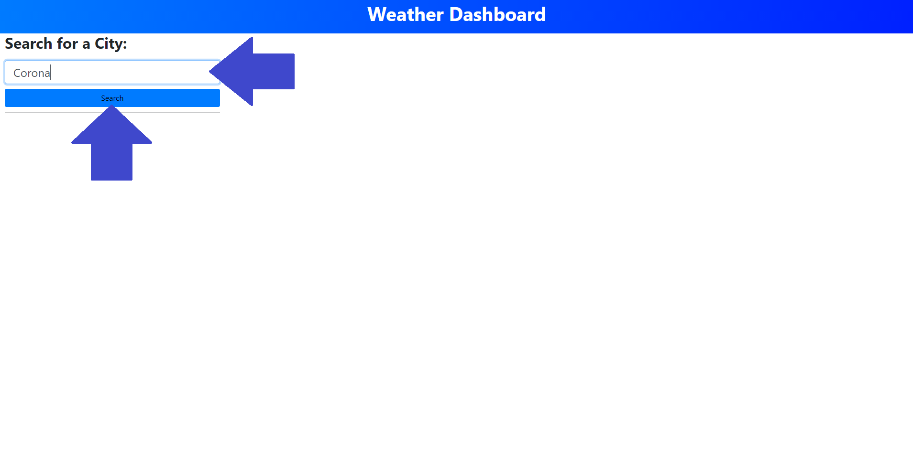
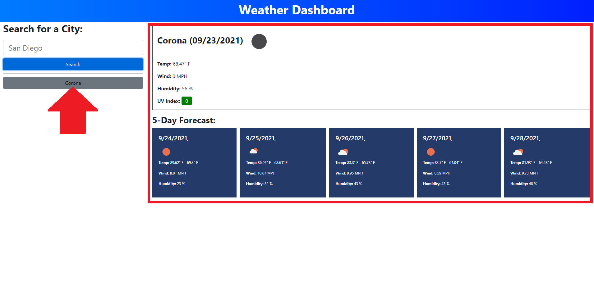
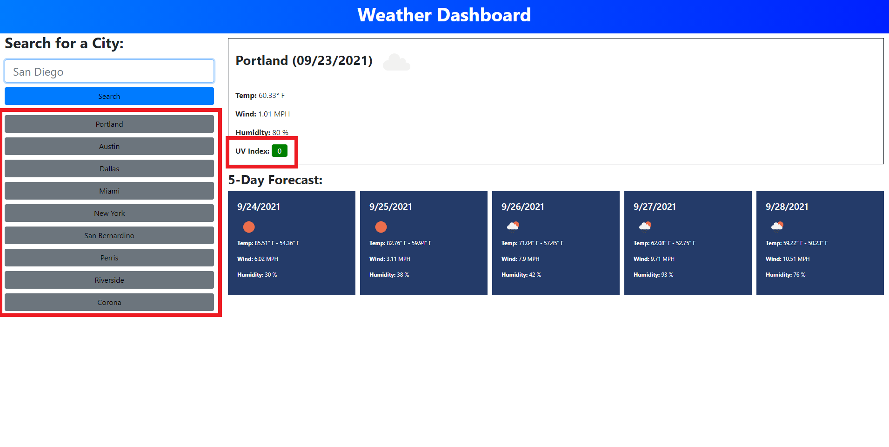

# Weather-Dashboard

## Description

This is a weather application that uses the [OpenWeather One Call API](https://openweathermap.org/api/one-call-api) to retrieve current and future weather forecast and dynamically displays it on the page. The application will allow you to enter over 200,000 different cities and gill give you the current temperature, wind speed, humidity level and UV index. It will also give you the same information for the following five days. This project really allowed me to work with Bootstrap and JavaScript, I really enjoyed creating elements and adding classes in JavaScript and then seeing them come to life in the page.

## Instructions

You can find the deployed application here&mdash;https://israelmrios.github.io/Weather-Dashboard/

## Demo


### Step 1
```
Enter a City Name in the search box and either click 'Search' or click 'Enter'.
```


### Step 2
```
The current weather will display on the top-right corner and the five-day forecast on the bottom-right.
```


### Step 3
```
Some additional features the application has are: Storing of previous search results and UV Index Color-Display. If the UV conditions are favorable the box will turn green, if they are moderate, you'll see it turn yellow and if conditions are severe the box will become red.
```


## Resources Used
* [GitHub](http://github.com)
* [MDN Web Docs](https://developer.mozilla.org)
* [W3 Schools](https://www.w3schools.com/)
* [JavaScript Cheat Sheet](https://websitesetup.org/javascript-cheat-sheet/)
* [Request-Response](https://coding-boot-camp.github.io/full-stack/github/professional-readme-guide)

## License
MIT License
Copyright (c) [2021] [Israel M. Rios]